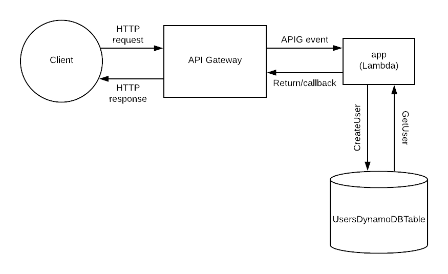

# NgSkool

This repo contains the Back End code for a technical test for a very innovative company in Sydney. For the Front End, please see [NgSkool_NG](https://github.com/jacktator/NgSkool_NG).

For more info, please see the [Introduction](https://github.com/jacktator/NgSkool_NG).

## Architecture

This repo follows the DynamoDB, Lambda, Serverless, Express and NodeJS architecture. For more information, please see [this guide](https://serverless.com/blog/serverless-express-rest-api/).

For more info on AWS DynamoDB & Lambda Stack, please see [AWS Tutorial](https://aws.amazon.com/getting-started/projects/build-serverless-web-app-lambda-apigateway-s3-dynamodb-cognito/).
Considering majority of NgSkool users will be in Australia. AWS ap-southeast-2 node, aka the Sydney Region is selected.

For more info on Serverless Architecture, please see [ServerLess](https://serverless.com).

## Stack

- [TypeScript](https://www.typescriptlang.org/)
- [DynamoDB](https://aws.amazon.com/dynamodb/)
- [Lambda](https://aws.amazon.com/lambda/)
- [Serverless](https://serverless.com/)
- [Express](https://expressjs.com/)
- [NodeJS](https://nodejs.org/en/)

While the API routing feature deliberately handled by Express instead of Lambda or Gateway API to reserve **application independence** from AWS Lambda. This is done in case I wish to use DyanmoDB only, and move the application hosting else where.  

## TOC

- [Roadmap](./docs/roadmap.md)
- [Testing](./docs/testing.md)
- [Deployment](./docs/deployment.md)
- [Issues](./docs/issues.md)
- [Conclusion](./docs/conclusion.md)

## Assignment Delivery

Please follow the following installation instructions.

1. Install packages.

> npm install

2. Start a offline server.

> sls offline start 

3. Open http://localhost:3000/
If you see 'hello world!', the backend is running.
