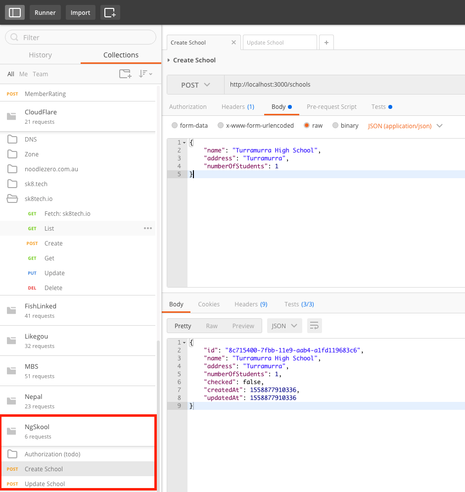
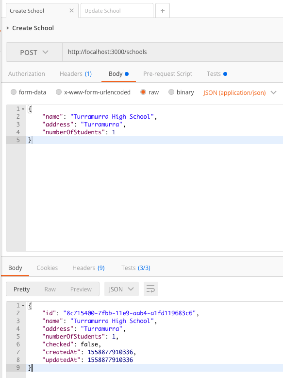
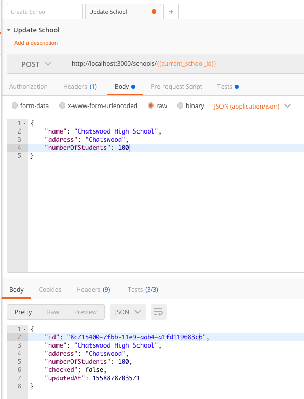
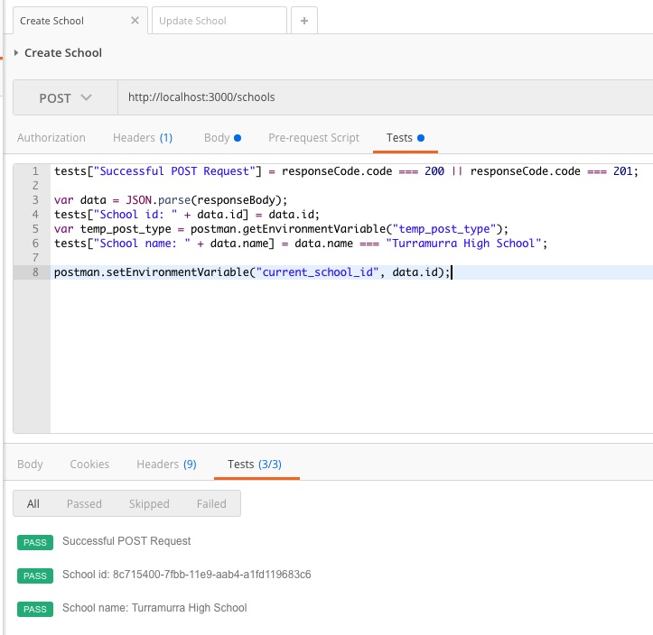
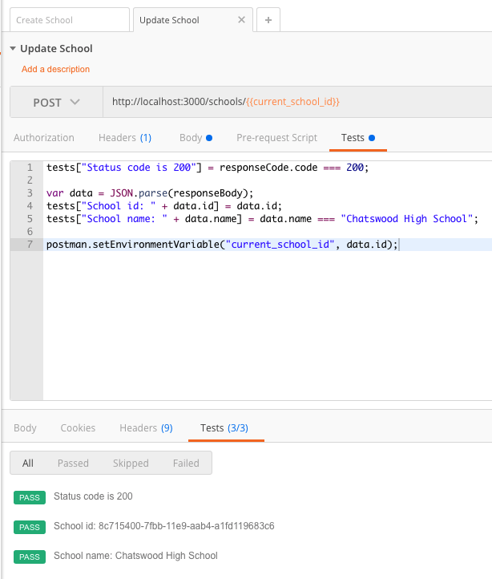

# Testing

## Unit Test

## REST API Test

REST API is the contract between FrontEnd and BackEnd. I'm using Postman to test REST API endpoints. 

#### Postman Collection

#### Postman Requests

#### Postman Test Scripts

#### Postman Collection runs

## Automation
