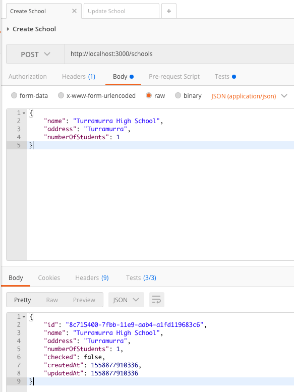
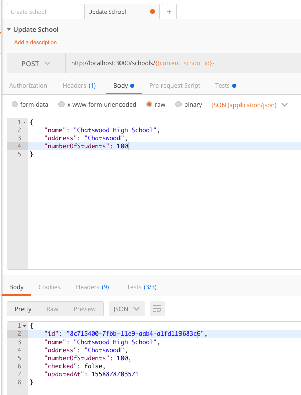
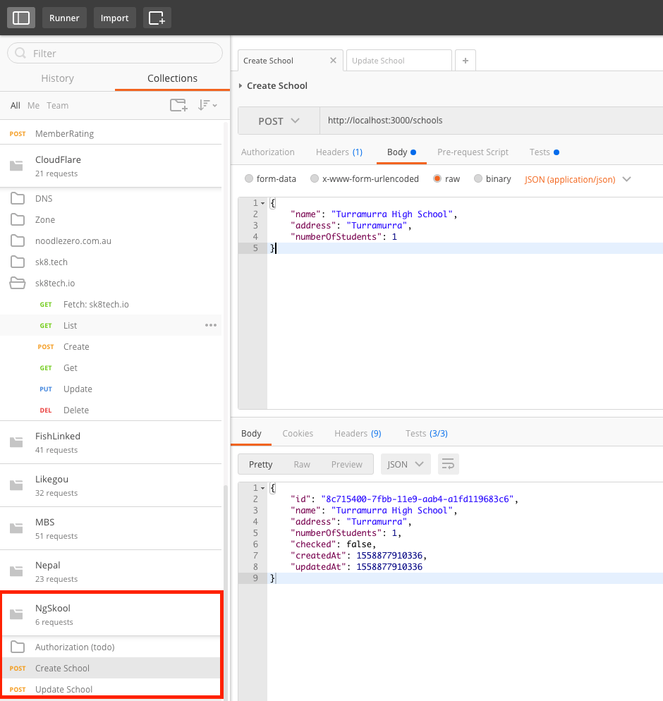
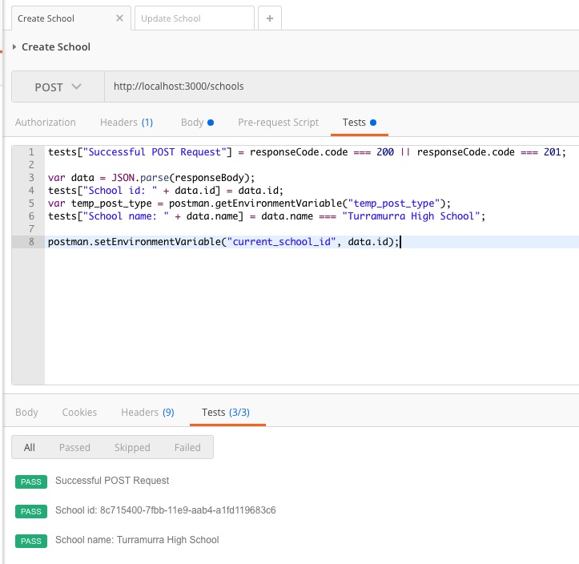
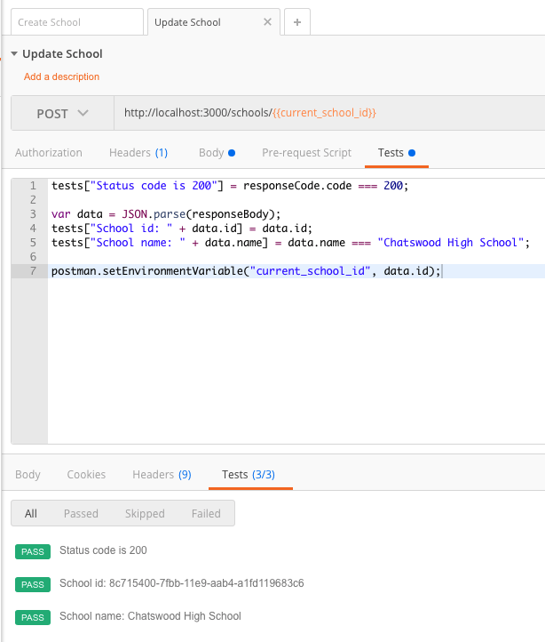

# Unit Test

Unit Test should be added for each database operation functions. 

TODO

# REST API Docs

Generate REST API docs using Swagger

TODO 

# REST API Test

REST API is the contract between FrontEnd and BackEnd. I'm using Postman to test REST API endpoints. 

## Postman Requests

Requests can be found below in [Collection[(#postman-collection).

## Postman Collection

Screenshot is provided below. Collection [can be found here](https://www.getpostman.com/collections/b218fe95e1c9b78884bd). Environment [can be found here](./testing/NgSkool_Local.postman_environment.json).  

.

[Docs: Import Collection](https://learning.getpostman.com/docs/postman/collections/sharing_collections/).

[Docs: Import Environment](https://learning.getpostman.com/docs/postman/environments_and_globals/manage_environments/).

## Postman Test Scripts

## Postman Collection runs

TODO. [Collection Runs Docs](https://learning.getpostman.com/docs/postman/collection_runs/intro_to_collection_runs/). 

# Automation

Use webpack to automate testing

Todo. 
